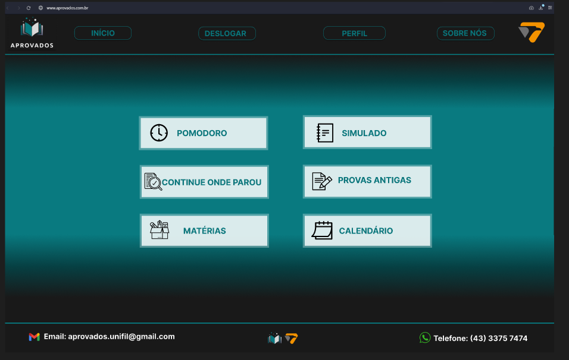
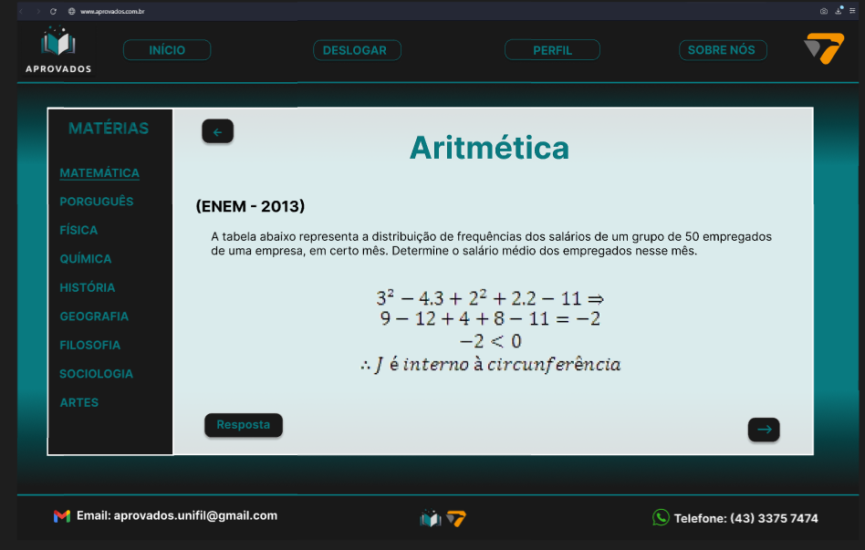

<!DOCTYPE html>
<html lang="en">
<head>
    <meta charset="UTF-8">
    <meta name="viewport" content="width=device-width, initial-scale=1.0">
</head>
<body>
  <h1>APROVADOS</h1>

  
  

  <h2>Descrição do Projeto</h2>
  
O objetivo do projeto será oferecer uma plataforma onde o aluno possa estudar de forma mais prática e dinâmica, disponibilizando uma interface capaz de usar métodos de estudos eficientes como o Pomodoro e também um sistema de agenda para marcar eventos e construir rotinas de estudos.

  <h2>Recursos e Funcionalidades</h2>
  <ul>
      <li>Tela Pomodoro: Programe seu tempo de estudo e descanso</li>
      <li>FlashCards: Deixe anotado em bloquinhos interativos para guardar informações importantes</li>
      <li>Agenda: Construa sua rotina de estudos e marque dias e eventos no calendário</li>
  </ul>

  <h2>Tecnologias Utilizadas</h2>
  <ul>
      <li>HTML5 e CSS3 para a estruturação e estilização da página.</li>
      <li>JavaScript para interações e funcionalidades dinâmicas (caso aplicável).</li>
      <li>MySQL para estruturação do Banco de Dados.</li>
    </ul>

  <h3>Equipe</h3>
  <ul>
      <li>Vitor Hugo Oliveira Paloco</li>
      <li>Victor Scheller Zuccoli</li>
      <li>Pedro Henrique Ramoni Ouro</li>
      <li>Igor Fellipe do Santos Gato</li>
      <li>Diego Vinícius do Santos</li>
    </ul>

  <h2>Contato</h2>
  
Se você tiver alguma dúvida, sugestão ou quiser entrar em contato comigo, sinta-se à vontade para me enviar um e-mail em <a href="mailto:vitor.paloco@edu.unifil.com">vitor.paloco@edu.unifil.com</a> ou me encontrar em <a href="https://www.linkedin.com/in/vitor-hugo-oliveira-paloco-b64126278/">LinkedIn</a>.

</body>
</html>
